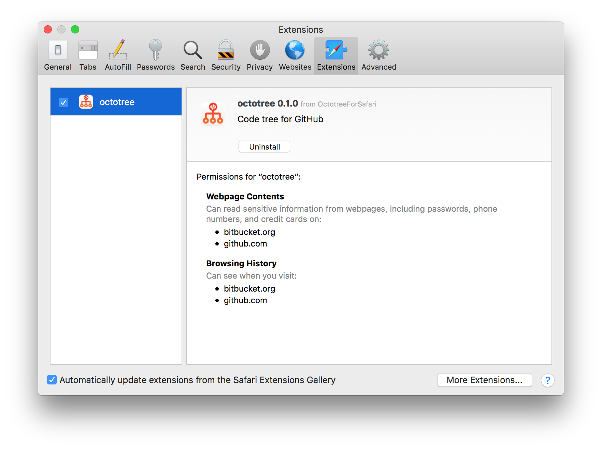

# OctotreeForSafari

`OctotreeForSafari` packages [buunguyen/octotree](https://github.com/buunguyen/octotree) into Safari App Extension.

## Requirements
- macOS 10.12 or later
- Safari 11.1.2 or later

## Installation
1. Download [OctotreeForSafari-0.2.1.zip](https://github.com/norio-nomura/OctotreeForSafari/releases/download/0.2.1/OctotreeForSafari-0.2.1.zip) (2019/02/01 updated)
2. Unzip it
3. Move `OctotreeForSafari` to `/Applications` folder
4. Launch `OctotreeForSafari`
5. Enable `octotree` in Safari > Preferences... > Extensions

## Author

Norio Nomura

## License

`OctotreeForSafari` is available under the GPL license. See the [LICENSE](LICENSE) file for more info.
